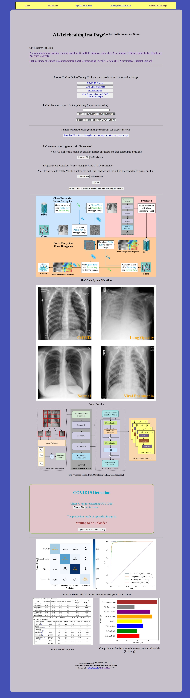

# AI-Telehealth-System-with-ViT-and-Kyper-Cryptographic
An Easy-to-Implement AI Telehealth System for Medical Diagnosis and [Post-Training Interpretation](https://github.com/TyBruceChen/Animated2GradCAM) (loading Grad-CAM images from the corresponding model with the interactive [animint2](https://github.com/animint/animint2) R package)  
**Conference Paper: A Highly Secure and Accurate System for COVID-19 Diagnosis from Chest X-ray Images** [google scholar](https://scholar.google.com/citations?view_op=view_citation&hl=en&user=r2ZKGxAAAAAJ&citation_for_view=r2ZKGxAAAAAJ:d1gkVwhDpl0C) or [IEEE](https://ieeexplore.ieee.org/abstract/document/10658795)

### Implementation details: 
We deploy the system locally and use the [fast reverse proxy (frp)](https://github.com/fatedier/frp) to expose the service to the public by connecting it to the Amazon server. We hold the local system using the Flask Python package.

### How it looks like:

